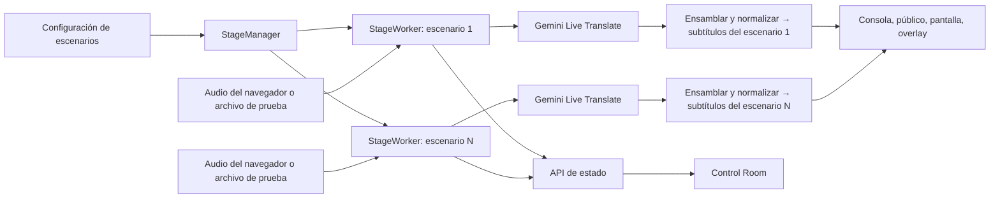

[English](README.md) | [Español](README.es.md)

# StagePulse

**Subtítulos en vivo para cada escenario.**

StagePulse es un sistema open source de subtítulos para conferencias con varios escenarios. Cada escenario activo envía una única señal de audio a Gemini Live Translate; StagePulse publica subtítulos originales en inglés y traducidos al español para operadores, asistentes, pantallas del recinto y overlays de transmisión. Los espectadores comparten el stream de su escenario y no abren sesiones de IA propias.

Se construyó durante la **Nerdearla Vibeathon 2026** para el desafío de subtitulado en vivo de varios escenarios. Tiene licencia [Apache 2.0](LICENSE).

## Por qué StagePulse

En una conferencia pueden suceder varias charlas a la vez, mientras el público necesita subtítulos en teléfonos, pantallas y herramientas de producción. Procesar el audio por separado para cada espectador multiplicaría las conexiones con el proveedor y dificultaría mantener sincronizadas las vistas. **La regla de escala es un pipeline de IA por escenario activo, no por espectador.** StagePulse distribuye los eventos en memoria de cada escenario a todas sus vistas.

El flujo del operador es **Preparar → Capturar → Traducir → Distribuir → Monitorear → Recuperar**. Los escenarios se declaran en JSON: la misma aplicación atiende cualquier sala configurada sin agregar código específico.

## Qué incluye

| Capacidad | Comportamiento |
| --- | --- |
| Entrada en vivo | El navegador del escenario captura el dispositivo elegido y envía PCM mono a 16 kHz. |
| Archivo de prueba | Un archivo local se sube al mismo `StageWorker` y FFmpeg lo decodifica a velocidad de reproducción. |
| Subtítulos en vivo | Gemini Live Translate entrega la transcripción inglesa y la traducción española. StagePulse ensambla y publica unidades provisionales y cerradas. |
| Smart Talk Prep | Sugerencias opcionales de Gemini a partir de título, orador y resumen; el operador revisa los términos antes de aplicar la normalización por escenario. |
| Público | Selector de escenarios, Audience View móvil, enlace para compartir y código QR. |
| Recinto y transmisión | Pantalla de sala y overlay transparente para subtítulos originales o en español. |
| Operación | Stage Console y Control Room muestran el estado del escenario, audio, proveedor, traducción, espectadores y conexiones. |

## Cómo funciona



`CaptionBus` es un componente en el proceso que separa los eventos por ID de escenario. Un suscriptor nuevo recibe el último subtítulo disponible de cada idioma y luego los eventos en vivo. Abrir otra vista no crea otro pipeline Gemini. Una reconexión puede aumentar el contador **acumulado** de conexiones de un escenario sin abrir dos pipelines simultáneos. La [guía de arquitectura](docs/architecture.md) detalla los componentes y la recuperación.

El modelo de traducción en vivo configurado es `gemini-3.5-live-translate-preview`. Las sugerencias opcionales de Smart Talk Prep usan `gemini-3.5-flash-lite`; la herramienta separada de transcripción de Gate 1 usa `gemini-3.5-transcribe-live`. Estos identificadores describen esta versión del código, sin garantizar disponibilidad futura de los modelos.

### Smart Talk Prep

Antes de iniciar un escenario, ingresá **título, orador y resumen** en Stage Console. **Sugerir terminología** hace una solicitud de texto opcional a `gemini-3.5-flash-lite` para proponer hasta 15 términos y variantes de escritura. Las sugerencias nunca se aplican solas: revisalas o editalas, agregá términos manualmente si hace falta y elegí **Aplicar al escenario**.

Los reemplazos aprobados se combinan con las reglas configuradas en el `TerminologyNormalizer` de ese escenario. Se aplican por idioma y con límites de palabra explícitos. La preparación se bloquea mientras **ese escenario** inicia o está activo; otra sala inactiva sigue editable. La solicitud ocurre fuera del camino de audio en vivo. No se midió una mejora de precisión atribuible a esta función.

## Inicio rápido: Windows PowerShell

Necesitás Python **3.10 o posterior** con `venv` (la validación local usó 3.13), FFmpeg en `PATH`, acceso de red a Gemini y un navegador compatible con micrófono y AudioWorklet. Los audios del desafío no están incluidos en el repositorio.

Desde la raíz del repositorio:

```powershell
.\scripts\setup.ps1
notepad .env                         # Configurá GEMINI_API_KEY localmente
.\scripts\doctor.ps1
.\scripts\start.ps1
```

`setup.ps1` crea `.venv`, instala [requirements.txt](requirements.txt), crea `.env` desde [.env.example](.env.example) si hace falta y comprueba FFmpeg. `doctor.ps1` revisa los requisitos locales, la presencia de la clave configurada, el JSON de escenarios y que el puerto 8000 esté libre. **No** valida la clave con Gemini ni demuestra que un archivo multimedia tenga audio. `start.ps1` inicia el servidor en `http://127.0.0.1:8000` por defecto. Abrí `/stage` en esa computadora.

Si PowerShell bloquea los scripts, usá una excepción **solo para ese proceso de PowerShell** y volvé a ejecutarlos:

```powershell
Set-ExecutionPolicy -Scope Process Bypass -Force
```

Para instalar manualmente, creá `.venv`, instalá `requirements.txt`, copiá `.env.example` a `.env`, agregá `GEMINI_API_KEY` y ejecutá `.\.venv\Scripts\python.exe backend\serve.py`. Los helpers aceptan `-Port` y `-Config`; `start.ps1` también acepta `-HostAddress`. Ejecutá `doctor.ps1` antes de iniciar el servidor, porque espera que el puerto esté libre.

### Prueba con un archivo de audio local

1. Abrí `/stage` y elegí una sala configurada.
2. Seleccioná **Fuente de audio → Archivo de prueba**, elegí un WAV local autorizado con voz audible y presioná **Iniciar**.
3. Mirá los subtítulos en inglés y español en Stage Console. Abrí `/audience/{stage_id}` o `/display/{stage_id}` para ver el mismo stream en vivo.
4. Presioná **Detener** al terminar.

El navegador sube el archivo a una ubicación temporal acotada (máximo **100 MiB**); el worker usa FFmpeg en tiempo real y elimina la carga al detenerse o completar normalmente. Se aceptan las extensiones `.wav`, `.mp3`, `.m4a`, `.flac`, `.ogg`, `.mp4`, `.mov` y `.webm`, siempre que FFmpeg pueda decodificarlas y exista una **pista de audio**. Un video sin audio o un archivo sin una pista de audio no puede generar subtítulos. La ruta `audio_file` de la configuración sirve para ejecuciones de archivo desde la línea de comandos; Archivo de prueba y entrada en vivo la reemplazan, y el archivo de muestra no está versionado.

Para **Entrada en vivo**, elegí el dispositivo de audio en Stage Console. El navegador necesita localhost o HTTPS como contexto seguro. Solo puede alimentar un escenario una fuente de audio a la vez; distintas pestañas pueden operar salas diferentes.

## Configurar escenarios

Editá [config/stages.gate3.json](config/stages.gate3.json). La configuración final del demo contiene exactamente estas salas:

| ID | Nombre |
| --- | --- |
| `gran-sala` | Gran sala |
| `auditorio` | Auditorio |
| `sala-abasto` | Sala Abasto |

Cada entrada JSON tiene `id`, `name`, `source_language` (`en`), `target_language` (`es`) y `audio_file`. Agregar una sala requiere editar la configuración y reiniciar el servidor; la aplicación no crea salas dinámicamente. `audio_file` debe apuntar a un archivo local si usás ejecuciones de archivo desde la línea de comandos. El mapa opcional `terminology` permite reemplazos explícitos como `"en": {"Word Perfect": "WordPerfect"}`; las tres salas del demo no traen reglas preconfiguradas. Los términos aprobados en Smart Talk Prep permanecen en memoria hasta reiniciar el servidor.

Por ejemplo, esta entrada de terminología **opcional** podría reemplazar la entrada actual de Gran sala; **no** está en la configuración incluida:

```json
{
  "id": "gran-sala",
  "name": "Gran sala",
  "source_language": "en",
  "target_language": "es",
  "audio_file": "../samples/nerdearla-freedos-60s.wav",
  "terminology": {
    "en": {"Word Perfect": "WordPerfect"},
    "es": {"Word Perfect": "WordPerfect"}
  }
}
```

## Rutas y entrega al público

| Ruta | Uso |
| --- | --- |
| `/stage` o `/stage?stage={stage_id}` | Stage Console; la sala elegida se conserva por pestaña. |
| `/audience` | Audience Hub con las salas configuradas. |
| `/audience/{stage_id}` | Audience View móvil con selección independiente de subtítulos Original/Español. |
| `/display/{stage_id}?lang=original\|es\|both` | Pantalla del recinto; valor predeterminado `both`. |
| `/overlay/{stage_id}?lang=original\|es` | Overlay transparente para una fuente de navegador; valor predeterminado `original`. |
| `/control` | Control Room central. |

El botón **Abrir vista del público** de Stage Console usa el origen del servidor actual. El enlace copiado y el QR usan el origen de la solicitud o `STAGEPULSE_PUBLIC_BASE_URL` en `.env` o en el entorno del proceso servidor (el valor del proceso tiene prioridad). Debe ser un **origen** HTTP(S), sin ruta. Para otros dispositivos usá una dirección alcanzable e iniciá el servidor con `-HostAddress 0.0.0.0` (o `--host 0.0.0.0`) para acceso por LAN; los QR con localhost solo funcionan en la computadora anfitriona. El acceso público requiere un origen HTTPS y reenvío de WebSockets; StagePulse **no** incluye terminación TLS ni un túnel público.

Audience View se reconecta cuando el navegador móvil vuelve al primer plano y recibe el último subtítulo en memoria de cada idioma. Muestra un contexto local breve, no un historial de subtítulos perdidos. El idioma de la interfaz (inglés/español) es una preferencia del navegador; el idioma de los subtítulos se elige por separado. Venue Display consume el mismo stream y también se reconecta. El overlay está diseñado para Browser Input de vMix o Browser Source de OBS, pero **no** se probó físicamente dentro de esas aplicaciones. No existe una integración oficial con la API de Swapcard; la incrustación genérica depende de que la plataforma permita iframes y WebSockets.

## Monitoreo y recuperación

Control Room consulta el estado de cada escenario: audio reciente, proveedor, salud de traducción, espectadores, conexiones/reconexiones, edad de la sesión, último subtítulo y errores. **Traducción OK** aparece solo si hay evidencia reciente de audio y salida original/española. **Traducción demorada** indica que el detector observó audio e inglés continuos sin español utilizable reciente. Si faltan datos, no muestra ninguno de los dos; el indicador no garantiza cobertura completa. La reconexión opcional por demora de traducción es solo de depuración y está desactivada por defecto.

El proveedor Live usa handles de reanudación de sesión y compresión de contexto con ventana deslizante. Ante un GoAway de Gemini abre una conexión posterior; ante desconexiones inesperadas hace reintentos acotados. Durante la reconexión conserva como máximo **102.400 bytes** (3,2 segundos de PCM mono a 16 kHz) del audio pendiente más reciente y puede descartar frames antiguos. No reenvía frames cuya entrega es incierta. El audio del navegador tiene otra cola acotada. El navegador del escenario puede reconectar su socket durante la ventana de recuperación; las vistas reciben el subtítulo actual, no el historial completo. Estos mecanismos reducen interrupciones, pero no garantizan subtítulos sin cortes.

## Validación y mediciones

La evidencia distingue el alcance de cada prueba:

| Observación | Alcance |
| --- | --- |
| Dos escenarios independientes simultáneos con audio y subtítulos reales | Validación manual integral anterior. |
| Tres salas ejecutando Archivo de prueba a la vez con subtítulos en inglés y español en Stage Console | [Prueba manual de tres salas registrada](docs/validation.md); Control Room mostró las tres en vivo y una conexión de proveedor por sala durante la prueba. |
| Cinco suscriptores de subtítulos en un escenario activo sin conexiones Gemini adicionales | Prueba manual de las vistas de producción. |
| Acceso del público por HTTPS/4G, recuperación tras recargar el navegador y respuesta real de Gemini en Smart Talk Prep | Validación del operador; las [notas de validación](docs/validation.md) explican los límites de la evidencia. |
| Audio de 13 minutos y 1 segundo con un GoAway real y reanudación | Prueba manual de confiabilidad; en esa ejecución no se reportaron errores ni PCM descartado. |
| Charla Nerdearla completa de unos 32 minutos procesada de principio a fin | Validación local reportada; no hay una traza versionada para auditarla independientemente. |

En **tres ejecuciones controladas por el navegador** de [Gate 7.5](benchmarks/gate75.md), la mediana desde el **primer paquete PCM recibido por el backend** hasta el **primer subtítulo publicado** fue de **4,65 s para inglés original** y **4,80 s para español**. No son latencias medidas desde el inicio del habla, máximos ni un SLA. [Gate 7.6](benchmarks/gate76.md) registra un caso extremo de salida del proveedor y explica por qué el experimento de recuperación en depuración no demostró una mejora para producción. No se calculó WER ni una cifra general de precisión.

## Tests y estructura del proyecto

```powershell
.\.venv\Scripts\python.exe -m unittest discover -s tests
node tests\test_audience_lifecycle.mjs
node tests\test_display_lifecycle.mjs
```

Node.js se necesita solo para los tests de ciclo de vida de JavaScript. Los checks manuales del navegador y scripts históricos de benchmarks están en `tests/`; los scripts de navegador apuntan a la configuración actual de tres salas, mientras que los fixtures aislados de archivo pueden seguir usando `main`. Las pruebas de navegador también requieren la configuración documentada de Chrome y dispositivos de audio.

| Ruta | Contenido |
| --- | --- |
| `backend/` | Servidor, manager/worker de escenarios, fuentes de audio, proveedores Gemini, bus de subtítulos y herramienta separada `transcribe_file.py`. |
| `frontend/` | Stage Console, Audience Hub/View, Venue Display, overlay, Control Room y catálogos EN/ES de interfaz. |
| `config/` | JSON de salas del demo y configuración histórica de pruebas prolongadas. |
| `scripts/` | Helpers de Windows para instalación, preflight e inicio. |
| `docs/` | Arquitectura, operación y notas de validación. |
| `benchmarks/` | Mediciones históricas y metodología. |

## Límites y seguridad

StagePulse funciona actualmente en un solo proceso y conserva el estado en memoria. **No tiene autenticación ni RBAC, base de datos, historial persistente de subtítulos ni coordinación entre procesos**. Se enfoca en traducción inglés → español. El acceso y las cuotas de los modelos Gemini preview, la red y las demoras ocasionales de salida del proveedor limitan la cantidad y calidad de escenarios concurrentes. El overlay no se verificó dentro de vMix u OBS. No hay integración oficial con Swapcard.

Guardá `GEMINI_API_KEY` en el archivo `.env` local e ignorado por Git; nunca la pegues en issues, logs, capturas o commits. Las trazas de diagnóstico incluyen texto de subtítulos: activá `--diagnostics` solo en pruebas controladas y mantené privados esos logs. Como el servidor no tiene control de acceso, usalo en una red confiable o agregá controles propios antes de exponerlo fuera de un demo controlado. Git también ignora los audios del desafío. Para pasos operativos y fallas comunes, consultá [operación](docs/operations.es.md).
