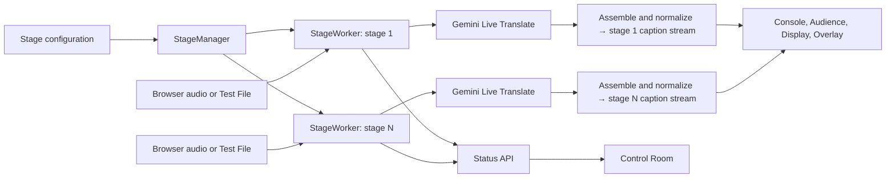

[English](README.md) | [Español](README.es.md)

# StagePulse

**Live captions for every stage.**

StagePulse is an open-source, multi-stage conference captioning system. Each active stage sends one audio stream to Gemini Live Translate; StagePulse publishes original English and Spanish captions to operators, attendees, venue screens, and browser-source overlays. Viewers share a stage's caption stream and do not open their own AI sessions.

Built during **Nerdearla Vibeathon 2026** for the live multi-stage captioning challenge. Licensed under [Apache 2.0](LICENSE).

## Why StagePulse

At a conference, several talks can run at once while the people who need captions are spread across phones, venue displays, and production tools. Processing audio separately for every viewer would multiply provider connections and make each view harder to keep in sync. **The scaling rule is one AI pipeline per active stage, not per viewer.** StagePulse distributes each stage's in-memory caption events to all of its viewers.

The operator flow is **Prepare → Capture → Translate → Distribute → Monitor → Recover**. Stages are declared in JSON; the same application serves any configured stage without adding stage-specific code.

## What it provides

| Capability | Behavior |
| --- | --- |
| Live input | A stage browser captures a chosen audio device and sends 16 kHz mono PCM. |
| Test File | A local file is uploaded to the same `StageWorker` and decoded at playback speed by FFmpeg. |
| Live captions | Gemini Live Translate supplies English input transcription and Spanish output transcription. StagePulse assembles and publishes provisional and closed caption units. |
| Smart Talk Prep | Optional Gemini suggestions from a talk title, speaker, and abstract; an operator reviews terms before applying stage-specific normalization. |
| Audience delivery | A stage hub, mobile Audience View, shareable URL, and QR code. |
| Venue and broadcast | A display route and a transparent browser overlay for original or Spanish captions. |
| Operations | Stage Console and Control Room show stage, audio, provider, translation, viewer, and connection state. |

## How it works



`CaptionBus` is one in-process component keyed by stage. A new caption subscriber gets the latest available caption per language and then live events. Opening another viewer does not create another Gemini pipeline. A provider reconnect may increase a stage's **cumulative** connection count without creating a second concurrent pipeline. See the [architecture guide](docs/architecture.md) for component boundaries and recovery behavior.

The configured live translation model is `gemini-3.5-live-translate-preview`. Optional Smart Talk Prep suggestions use `gemini-3.5-flash-lite`; the separate Gate 1 transcription utility uses `gemini-3.5-transcribe-live`. These identifiers describe this checkout, not guaranteed future model availability.

### Smart Talk Prep

Before starting a stage, enter a **title, speaker, and abstract** in Stage Console. **Suggest terminology** makes an optional text request to `gemini-3.5-flash-lite` for up to 15 candidate terms and spelling variants. Suggestions are never applied automatically: review or edit them, add terms manually if needed, and select **Apply to stage**.

The approved replacements are combined with any configured rules in that stage's `TerminologyNormalizer`. They use explicit word-boundary matching in each caption language. Preparation is locked while **that stage** is starting or running; another inactive stage remains editable. This request happens outside the live audio path. No accuracy improvement has been measured for this feature.

## Quick start: Windows PowerShell

Use Python **3.10 or newer** with `venv` (the local validation used 3.13), FFmpeg on `PATH`, network access to Gemini, and a browser with microphone and AudioWorklet support. The repository does not include the challenge audio files.

From the repository root:

```powershell
.\scripts\setup.ps1
notepad .env                         # Set GEMINI_API_KEY locally
.\scripts\doctor.ps1
.\scripts\start.ps1
```

`setup.ps1` creates `.venv`, installs [requirements.txt](requirements.txt), creates `.env` from [.env.example](.env.example) if needed, and checks FFmpeg. `doctor.ps1` checks local prerequisites, the configured key's presence, stage JSON, and whether port 8000 is free. It does **not** validate the key with Gemini or prove that a media file has an audio stream. `start.ps1` starts the server at `http://127.0.0.1:8000` by default. Open `/stage` on that computer.

If PowerShell blocks the scripts, use a bypass **for this PowerShell process only**, then rerun the commands:

```powershell
Set-ExecutionPolicy -Scope Process Bypass -Force
```

For manual setup, create `.venv`, install `requirements.txt`, copy `.env.example` to `.env`, add `GEMINI_API_KEY`, and run `.\.venv\Scripts\python.exe backend\serve.py`. The helper scripts accept `-Port` and `-Config`; `start.ps1` also accepts `-HostAddress`. Run `doctor.ps1` before starting the server, since it expects the port to be free.

### Test with a local audio file

1. Open `/stage` and select a configured room.
2. Set **Audio source → Test file**, choose an authorized local WAV containing audible speech, and press **Start**.
3. Watch English and Spanish captions in Stage Console. Open `/audience/{stage_id}` or `/display/{stage_id}` to see the same live stream.
4. Press **Stop** when finished.

The browser uploads the file to a bounded temporary file (maximum **100 MiB**); the worker uses FFmpeg in real time and removes the upload after stop or normal completion. Accepted extensions are `.wav`, `.mp3`, `.m4a`, `.flac`, `.ogg`, `.mp4`, `.mov`, and `.webm`, subject to FFmpeg decoding and an actual **audio stream**. A silent video or a media file without an audio track cannot produce captions. The bundled stage configuration's `audio_file` path is for file-backed command-line runs; Test File and browser live input replace that source, and the sample file is not committed.

For **Live input**, choose the audio device in Stage Console instead. Browser capture needs localhost or HTTPS as a secure context. Only one audio source can feed a stage at a time; separate tabs can operate different stages.

## Configure stages

Edit [config/stages.gate3.json](config/stages.gate3.json). The final demo configuration contains exactly these rooms:

| ID | Name |
| --- | --- |
| `gran-sala` | Gran sala |
| `auditorio` | Auditorio |
| `sala-abasto` | Sala Abasto |

Each JSON entry supplies `id`, `name`, `source_language` (`en`), `target_language` (`es`), and `audio_file`. Adding a room is a configuration change, followed by a server restart; the app does not create rooms dynamically. `audio_file` must point to a local file if you use file-backed command-line runs. An optional `terminology` map can specify explicit replacements such as `"en": {"Word Perfect": "WordPerfect"}`; none is preconfigured for the three demo rooms. Approved Smart Talk Prep terms remain in server memory until restart.

For example, this **optional** terminology entry could replace the existing Gran sala entry; it is **not** in the shipped configuration:

```json
{
  "id": "gran-sala",
  "name": "Gran sala",
  "source_language": "en",
  "target_language": "es",
  "audio_file": "../samples/nerdearla-freedos-60s.wav",
  "terminology": {
    "en": {"Word Perfect": "WordPerfect"},
    "es": {"Word Perfect": "WordPerfect"}
  }
}
```

## Routes and audience delivery

| Route | Purpose |
| --- | --- |
| `/stage` or `/stage?stage={stage_id}` | Stage Console; the selected room is retained per browser tab. |
| `/audience` | Audience Hub listing configured rooms. |
| `/audience/{stage_id}` | Mobile Audience View with independent Original/Spanish caption selection. |
| `/display/{stage_id}?lang=original\|es\|both` | Venue display; default `both`. |
| `/overlay/{stage_id}?lang=original\|es` | Transparent browser-source overlay; default `original`. |
| `/control` | Central Control Room. |

Stage Console's **Open Audience View** button uses the current server origin. The copied audience URL and QR code use the request origin, or `STAGEPULSE_PUBLIC_BASE_URL` in `.env` or the server process environment (the process value takes precedence). The setting must be an HTTP(S) **origin**, without a path. For audience devices, use an address they can reach and start the server with `-HostAddress 0.0.0.0` (or `--host 0.0.0.0`) for LAN access; localhost QR links work only on the host computer. Public access needs a reachable HTTPS origin and WebSocket forwarding; TLS or a public tunnel is **not** bundled with StagePulse.

Audience View reconnects when a mobile browser returns to the foreground and receives the latest in-memory caption per language. It shows a small rolling local context, not a backlog of missed captions. UI language (English/Spanish) is a browser-wide preference; caption language is independent. Venue Display uses the same stream and reconnects. The overlay is designed for a vMix Browser Input or OBS Browser Source, but has **not** been physically tested inside either application. There is no official Swapcard API integration; generic embedding depends on the event platform allowing iframes and WebSockets.

## Monitoring and recovery

Control Room polls each configured stage for audio freshness, provider state, translation health, viewer count, connection/reconnect counts, session age, last caption, and errors. **Translation OK** appears only when recent audio and raw English/Spanish output support it. **Translation delayed** means the detector has evidence of continuing audio and English output without recent usable Spanish. With insufficient evidence it shows neither; the indicator is not a completeness guarantee. The optional translation-stall reconnect is debug-only and off by default.

The live provider uses session-resumption handles and sliding-window context compression. On Gemini GoAway it opens a subsequent connection; unexpected disconnects use bounded retries. During a reconnect, the provider retains at most **102,400 bytes** (3.2 seconds at 16 kHz mono PCM) of newest unsent audio and can drop older frames. Uncertainly delivered frames are not replayed. Browser audio has a separate bounded queue. A stage browser can reconnect its audio socket during the recovery window; viewers receive the current caption snapshot rather than full history. These mechanisms reduce interruption but do not guarantee uninterrupted captions.

## Validation and measured results

The evidence is intentionally separated by scope:

| Observation | Scope |
| --- | --- |
| Two independent simultaneous stages with real audio and captions | Earlier end-to-end manual validation. |
| Three rooms running Test File concurrently with English and Spanish Stage Console captions | [Recorded three-stage manual check](docs/validation.md); Control Room showed all three LIVE and one provider connection per stage during the check. |
| Five caption subscribers on one active stage without extra Gemini connections | Manual production-view check. |
| Audience access over public HTTPS/4G, browser reload recovery, and Smart Talk Prep returning real Gemini suggestions | Operator validation; see [validation notes](docs/validation.md) for evidence limits. |
| A 13-minute, 1-second audio run with one real GoAway and resumption | Manual reliability check; no error or dropped PCM was reported in that run. |
| A complete approximately 32-minute Nerdearla talk processed end to end | Reported local validation; no committed trace is available for independent audit. |

Across **three controlled browser-path runs** in [Gate 7.5](benchmarks/gate75.md), median time from the **first PCM packet received by the backend** to the **first published caption** was **4.65 s for original English** and **4.80 s for Spanish**. These are not speech-onset latencies, maximums, or an SLA. [Gate 7.6](benchmarks/gate76.md) documents a provider-side output outlier and explains why its debug recovery experiment did not establish a production improvement. No WER or general accuracy score is claimed.

## Tests and project layout

```powershell
.\.venv\Scripts\python.exe -m unittest discover -s tests
node tests\test_audience_lifecycle.mjs
node tests\test_display_lifecycle.mjs
```

Node.js is needed only for the JavaScript lifecycle tests. Manual browser checks and historical benchmark scripts live in `tests/`; browser scripts target the current three-room configuration, while isolated historical file fixtures may still use `main`. Browser checks also require their documented Chrome and audio-device setup.

| Path | Contents |
| --- | --- |
| `backend/` | Server, stage manager/worker, audio sources, Gemini providers, caption bus, and separate `transcribe_file.py` utility. |
| `frontend/` | Stage Console, Audience Hub/View, Venue Display, overlay, Control Room, and EN/ES UI catalogs. |
| `config/` | Demo stage JSON and historical soak configuration. |
| `scripts/` | Windows setup, preflight, and start helpers. |
| `docs/` | Architecture, operations, and validation notes. |
| `benchmarks/` | Historical measured results and methodology. |

## Limits and security

StagePulse currently serves one in-memory process. It has **no authentication or RBAC, database, persistent caption history, or cross-process coordination**. It focuses on English-to-Spanish translation. Gemini preview-model access, quotas, network conditions, and occasional provider-side output delays limit the number and quality of concurrent stages. The browser overlay has not been verified inside vMix or OBS. There is no official Swapcard integration.

Keep `GEMINI_API_KEY` in the local, ignored `.env` file; never paste it into issues, logs, screenshots, or commits. Diagnostic traces include caption text, so enable `--diagnostics` only for controlled tests and keep those logs private. The server has no access control, so use a trusted network or add your own access controls before exposing it beyond a controlled demo. Challenge media is also ignored by Git. For operating steps and failures, see [operations](docs/operations.md).
