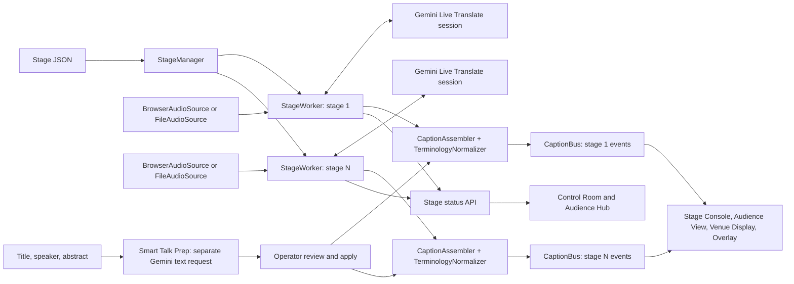

# StagePulse architecture

[README](../README.md) · [Operations](operations.md) · [Validation](validation.md)

StagePulse is a single-process, in-memory application. [The stage configuration](../config/stages.gate3.json) defines the room IDs and names. `StageManager` constructs one independent `StageWorker` and one Gemini Live Translate provider object for each configured room; a provider connection opens only when its stage starts. The same application code handles stage 1 through stage N.

The diagram shows **logical per-stage streams**. The implementation has one `CaptionBus` object with subscribers and latest events keyed by stage ID, not one process or bus instance per room. Talk Prep applies terms only to the room the operator selected; its request is outside the live caption path.

## Audio and provider

- **Live input:** Stage Console's browser captures an audio device, converts it to 16 kHz mono 16-bit PCM, and sends it through `/ws/stages/{stage_id}/audio` to `BrowserAudioSource`. One browser audio socket is accepted per stage. A disconnected browser has a 15-second reconnection window before the stage is stopped.
- **Test File:** The browser uploads an allowed file through `/api/stages/{stage_id}/test-file`. The server bounds it to 100 MiB, gives the same worker a temporary `FileAudioSource`, and FFmpeg decodes its audio at playback speed. The upload is removed after a normal finish or explicit stop. Files without a decodable audio stream produce no captions. `audio_file` in stage JSON is the fallback source for file-backed command-line runs.
- **Translation:** An active English-to-Spanish worker uses `gemini-3.5-live-translate-preview`. Its input and output transcription fields supply English and Spanish fragments. The separate Gate 1 file utility uses `gemini-3.5-transcribe-live`; Smart Talk Prep uses `gemini-3.5-flash-lite` for optional suggestions. Those are the configured model identifiers, not a promise of future availability.

Each active stage has its own worker/provider lifecycle. Audience clients never invoke Gemini. Provider reconnections are sequential within the same worker; the `connections` status field counts connections over time, so it can exceed one after recovery without implying concurrent pipelines.

## Captions and fan-out

`StageWorker` keeps a `CaptionAssembler` for each caption language. It turns provider fragments into provisional previews and closed units, then applies the selected stage's explicit `TerminologyNormalizer` rules before publishing immutable `CaptionEvent` values to `CaptionBus`.

`CaptionEvent.is_final` means **StagePulse closed that caption unit and will not revise it**. It does not require an explicit Gemini final signal: punctuation, length, elapsed time, provider boundaries, or a final snapshot can close the unit. It does not mean the full talk is complete.

The caption WebSocket `/ws/stages/{stage_id}/captions` subscribes to events for one stage. A late subscriber receives the latest in-memory event for each language, then live events. Each subscriber queue is bounded; on overflow, the oldest queued event is discarded. Starting a new run clears the previous run's latest events. This is live fan-out and a current snapshot, **not persistent history or replay**. Audience View keeps only a small local rolling display window and clears stale context on reconnect.

Stage Console, Audience View, Venue Display, and the transparent overlay subscribe to caption events. Audience Hub and Control Room instead poll the stage status API. Opening viewers changes subscriber counts, not provider-session count. The overlay can be used as a browser-source URL in production software; actual behavior inside vMix and OBS has not been physically verified.

## Health and recovery

The status API exposes state, provider status, audio and caption timestamps, viewers, cumulative connections and reconnects, session age, GoAway and resumption observations, dropped audio bytes, errors, and translation health. **Translation OK** requires recent audio and raw English/Spanish events. **Translation delayed** requires evidence of continuing audio and English output without recent Spanish; missing evidence yields neither label. This detector does not prove complete caption coverage. The translation-stall reconnect switch is debug-only and off by default.

The provider keeps the latest usable session-resumption handle in memory and requests sliding-window context compression. Gemini GoAway starts a subsequent connection; unexpected disconnects use bounded retry attempts. The provider holds at most 102,400 bytes of newest unsent PCM during a gap and may drop older frames. It does not replay frames whose delivery is uncertain. The browser audio source has a separate bounded queue. A stage-browser reload can reconnect to the same active worker during the audio-socket recovery window. Recovery reduces interruptions but cannot guarantee no missed captions.

Stage Console stores selected-stage and live-capture state per browser tab; UI-language preference remains browser-wide. Audience and display pages reconnect their caption sockets after returning to the foreground and take the current snapshot rather than rebuilding missed history.

## Deployment boundary

The HTTP/WebSocket bridge serves `/stage`, `/audience`, `/audience/{stage_id}`, `/display/{stage_id}`, `/overlay/{stage_id}`, and `/control`. It does not provide TLS termination, authentication, a database, Redis, cross-process coordination, or an official event-platform API integration. A second server process would have separate workers, buses, and memory; the current architecture does not synchronize them. See [operations](operations.md) for deployment prerequisites and failure handling, and [validation](validation.md) for measured evidence and its limits.
