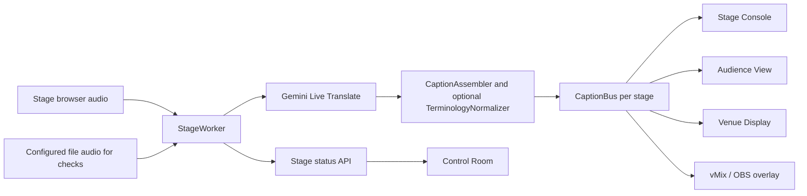

# StagePulse architecture

StagePulse is a single-process, in-memory service. Stage count comes from `config/stages.gate3.json`; each stage has an independent worker and one Gemini Live Translate pipeline. Adding an audience, stage-console caption view, venue display, or broadcast overlay adds a subscriber to the same stage bus, not another provider session.

The stage browser sends PCM through `/ws/stages/{stage_id}/audio`. `StageWorker` owns caption assembly for that stage and keeps original and Spanish streams separate. The optional terminology map performs only configured text replacements before a `CaptionEvent` is published. An `is_final` event means StagePulse closed that caption unit; it does not necessarily mean Gemini sent an explicit final signal.

The provider retains a resumption handle in memory. On GoAway it closes the current connection and opens the next using the latest valid handle. Unexpected disconnects use bounded retries. Incoming audio continues into a small bounded buffer during a reconnect; stale unsent frames can be dropped. The worker and subscribers remain attached to the same logical stage. Browser reloads can reconnect audio to the active stage during the recovery window.

The HTTP/WebSocket bridge serves `/stage`, `/audience`, `/audience/{stage_id}`, `/display/{stage_id}`, `/overlay/{stage_id}`, and `/control`. Caption views subscribe through `/ws/stages/{stage_id}/captions`; the audience hub and Control Room poll the real status API without reading caption text. Audience QR generation uses an HTTP(S) origin from the request or `STAGEPULSE_PUBLIC_BASE_URL` and runs locally. UI language preference is browser-local and independent of caption language.

There is no database, Redis, persistent caption history, cross-process distribution, or authentication. A second server instance would have its own independent in-memory buses and workers; this implementation does not coordinate them. See [README](../README.md) for validation evidence and operational limits.
